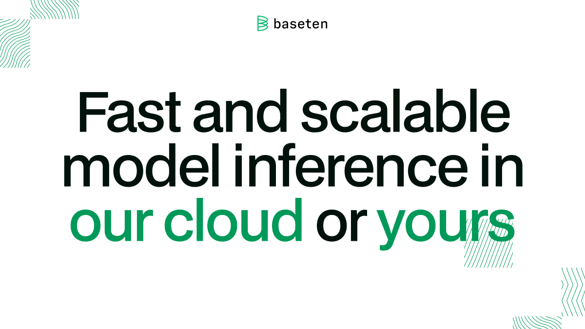

<div align="center">

[](https://baseten.co)

# Baseten<a id="baseten"></a>

REST API for management of Baseten resources


</div>

## Table of Contents<a id="table-of-contents"></a>

<!-- toc -->

- [Requirements](#requirements)
- [Installation](#installation)
- [Getting Started](#getting-started)
- [Async](#async)
- [Raw HTTP Response](#raw-http-response)
- [Reference](#reference)
  * [`baseten.autoscaling_setting.update_deployment_settings`](#basetenautoscaling_settingupdate_deployment_settings)
  * [`baseten.autoscaling_setting.update_development_setting`](#basetenautoscaling_settingupdate_development_setting)
  * [`baseten.autoscaling_setting.update_status`](#basetenautoscaling_settingupdate_status)
  * [`baseten.deployment.details_get`](#basetendeploymentdetails_get)
  * [`baseten.deployment.get_development_details`](#basetendeploymentget_development_details)
  * [`baseten.deployment.get_production_details`](#basetendeploymentget_production_details)
  * [`baseten.model.deploy_promote`](#basetenmodeldeploy_promote)
  * [`baseten.model.deployment_promote`](#basetenmodeldeployment_promote)
  * [`baseten.model.get_all_deployments`](#basetenmodelget_all_deployments)
  * [`baseten.model.get_all_models`](#basetenmodelget_all_models)
  * [`baseten.model.get_model_by_id`](#basetenmodelget_model_by_id)
  * [`baseten.secret.get_all_secrets`](#basetensecretget_all_secrets)
  * [`baseten.secret.upsert_new_secret`](#basetensecretupsert_new_secret)

<!-- tocstop -->

## Requirements<a id="requirements"></a>

Python >=3.7

## Installation<a id="installation"></a>
<div align="center">
  <a href="https://konfigthis.com/sdk-sign-up?company=Baseten&language=Python">
    
  </a>
</div>

## Getting Started<a id="getting-started"></a>

```python
from pprint import pprint
from baseten_python_sdk import Baseten, ApiException

baseten = Baseten(
    api_key_auth="YOUR_API_KEY",
)

try:
    # Updates a deployment's autoscaling settings
    update_deployment_settings_response = (
        baseten.autoscaling_setting.update_deployment_settings(
            model_id="model_id_example",
            deployment_id="deployment_id_example",
            min_replica=1,
            max_replica=1,
            autoscaling_window=1,
            scale_down_delay=1,
            concurrency_target=1,
        )
    )
    print(update_deployment_settings_response)
except ApiException as e:
    print(
        "Exception when calling AutoscalingSettingApi.update_deployment_settings: %s\n"
        % e
    )
    pprint(e.body)
    pprint(e.headers)
    pprint(e.status)
    pprint(e.reason)
    pprint(e.round_trip_time)
```

## Async<a id="async"></a>

`async` support is available by prepending `a` to any method.

```python
import asyncio
from pprint import pprint
from baseten_python_sdk import Baseten, ApiException

baseten = Baseten(
    api_key_auth="YOUR_API_KEY",
)


async def main():
    try:
        # Updates a deployment's autoscaling settings
        update_deployment_settings_response = (
            await baseten.autoscaling_setting.aupdate_deployment_settings(
                model_id="model_id_example",
                deployment_id="deployment_id_example",
                min_replica=1,
                max_replica=1,
                autoscaling_window=1,
                scale_down_delay=1,
                concurrency_target=1,
            )
        )
        print(update_deployment_settings_response)
    except ApiException as e:
        print(
            "Exception when calling AutoscalingSettingApi.update_deployment_settings: %s\n"
            % e
        )
        pprint(e.body)
        pprint(e.headers)
        pprint(e.status)
        pprint(e.reason)
        pprint(e.round_trip_time)


asyncio.run(main())
```

## Raw HTTP Response<a id="raw-http-response"></a>

To access raw HTTP response values, use the `.raw` namespace.

```python
from pprint import pprint
from baseten_python_sdk import Baseten, ApiException

baseten = Baseten(
    api_key_auth="YOUR_API_KEY",
)

try:
    # Updates a deployment's autoscaling settings
    update_deployment_settings_response = (
        baseten.autoscaling_setting.raw.update_deployment_settings(
            model_id="model_id_example",
            deployment_id="deployment_id_example",
            min_replica=1,
            max_replica=1,
            autoscaling_window=1,
            scale_down_delay=1,
            concurrency_target=1,
        )
    )
    pprint(update_deployment_settings_response.body)
    pprint(update_deployment_settings_response.body["status"])
    pprint(update_deployment_settings_response.body["message"])
    pprint(update_deployment_settings_response.headers)
    pprint(update_deployment_settings_response.status)
    pprint(update_deployment_settings_response.round_trip_time)
except ApiException as e:
    print(
        "Exception when calling AutoscalingSettingApi.update_deployment_settings: %s\n"
        % e
    )
    pprint(e.body)
    pprint(e.headers)
    pprint(e.status)
    pprint(e.reason)
    pprint(e.round_trip_time)
```


## Reference<a id="reference"></a>
### `baseten.autoscaling_setting.update_deployment_settings`<a id="basetenautoscaling_settingupdate_deployment_settings"></a>

Updates a deployment's autoscaling settings and returns the update status.

#### 🛠️ Usage<a id="🛠️-usage"></a>

```python
update_deployment_settings_response = (
    baseten.autoscaling_setting.update_deployment_settings(
        model_id="model_id_example",
        deployment_id="deployment_id_example",
        min_replica=1,
        max_replica=1,
        autoscaling_window=1,
        scale_down_delay=1,
        concurrency_target=1,
    )
)
```

#### ⚙️ Parameters<a id="⚙️-parameters"></a>

##### model_id: `str`<a id="model_id-str"></a>

##### deployment_id: `str`<a id="deployment_id-str"></a>

##### min_replica: `int`<a id="min_replica-int"></a>

Minimum number of replicas

##### max_replica: `int`<a id="max_replica-int"></a>

Maximum number of replicas

##### autoscaling_window: `int`<a id="autoscaling_window-int"></a>

Timeframe of traffic considered for autoscaling decisions

##### scale_down_delay: `int`<a id="scale_down_delay-int"></a>

Waiting period before scaling down any active replica

##### concurrency_target: `int`<a id="concurrency_target-int"></a>

Number of requests per replica before scaling up

#### ⚙️ Request Body<a id="⚙️-request-body"></a>

[`UpdateAutoscalingSettingsV1`](./baseten_python_sdk/type/update_autoscaling_settings_v1.py)
#### 🔄 Return<a id="🔄-return"></a>

[`UpdateAutoscalingSettingsResponseV1`](./baseten_python_sdk/pydantic/update_autoscaling_settings_response_v1.py)

#### 🌐 Endpoint<a id="🌐-endpoint"></a>

`/v1/models/{model_id}/deployments/{deployment_id}/autoscaling_settings` `patch`

[🔙 **Back to Table of Contents**](#table-of-contents)

---

### `baseten.autoscaling_setting.update_development_setting`<a id="basetenautoscaling_settingupdate_development_setting"></a>

Updates a development deployment's autoscaling settings and returns the update status.

#### 🛠️ Usage<a id="🛠️-usage"></a>

```python
update_development_setting_response = (
    baseten.autoscaling_setting.update_development_setting(
        model_id="model_id_example",
        min_replica=1,
        max_replica=1,
        autoscaling_window=1,
        scale_down_delay=1,
        concurrency_target=1,
    )
)
```

#### ⚙️ Parameters<a id="⚙️-parameters"></a>

##### model_id: `str`<a id="model_id-str"></a>

##### min_replica: `int`<a id="min_replica-int"></a>

Minimum number of replicas

##### max_replica: `int`<a id="max_replica-int"></a>

Maximum number of replicas

##### autoscaling_window: `int`<a id="autoscaling_window-int"></a>

Timeframe of traffic considered for autoscaling decisions

##### scale_down_delay: `int`<a id="scale_down_delay-int"></a>

Waiting period before scaling down any active replica

##### concurrency_target: `int`<a id="concurrency_target-int"></a>

Number of requests per replica before scaling up

#### ⚙️ Request Body<a id="⚙️-request-body"></a>

[`UpdateAutoscalingSettingsV1`](./baseten_python_sdk/type/update_autoscaling_settings_v1.py)
#### 🔄 Return<a id="🔄-return"></a>

[`UpdateAutoscalingSettingsResponseV1`](./baseten_python_sdk/pydantic/update_autoscaling_settings_response_v1.py)

#### 🌐 Endpoint<a id="🌐-endpoint"></a>

`/v1/models/{model_id}/deployments/development/autoscaling_settings` `patch`

[🔙 **Back to Table of Contents**](#table-of-contents)

---

### `baseten.autoscaling_setting.update_status`<a id="basetenautoscaling_settingupdate_status"></a>

Updates a production deployment's autoscaling settings and returns the update status.

#### 🛠️ Usage<a id="🛠️-usage"></a>

```python
update_status_response = baseten.autoscaling_setting.update_status(
    model_id="model_id_example",
    min_replica=1,
    max_replica=1,
    autoscaling_window=1,
    scale_down_delay=1,
    concurrency_target=1,
)
```

#### ⚙️ Parameters<a id="⚙️-parameters"></a>

##### model_id: `str`<a id="model_id-str"></a>

##### min_replica: `int`<a id="min_replica-int"></a>

Minimum number of replicas

##### max_replica: `int`<a id="max_replica-int"></a>

Maximum number of replicas

##### autoscaling_window: `int`<a id="autoscaling_window-int"></a>

Timeframe of traffic considered for autoscaling decisions

##### scale_down_delay: `int`<a id="scale_down_delay-int"></a>

Waiting period before scaling down any active replica

##### concurrency_target: `int`<a id="concurrency_target-int"></a>

Number of requests per replica before scaling up

#### ⚙️ Request Body<a id="⚙️-request-body"></a>

[`UpdateAutoscalingSettingsV1`](./baseten_python_sdk/type/update_autoscaling_settings_v1.py)
#### 🔄 Return<a id="🔄-return"></a>

[`UpdateAutoscalingSettingsResponseV1`](./baseten_python_sdk/pydantic/update_autoscaling_settings_response_v1.py)

#### 🌐 Endpoint<a id="🌐-endpoint"></a>

`/v1/models/{model_id}/deployments/production/autoscaling_settings` `patch`

[🔙 **Back to Table of Contents**](#table-of-contents)

---

### `baseten.deployment.details_get`<a id="basetendeploymentdetails_get"></a>

Gets a model's deployment by id and returns the deployment.

#### 🛠️ Usage<a id="🛠️-usage"></a>

```python
details_get_response = baseten.deployment.details_get(
    model_id="model_id_example",
    deployment_id="deployment_id_example",
)
```

#### ⚙️ Parameters<a id="⚙️-parameters"></a>

##### model_id: `str`<a id="model_id-str"></a>

##### deployment_id: `str`<a id="deployment_id-str"></a>

#### 🔄 Return<a id="🔄-return"></a>

[`DeploymentV1`](./baseten_python_sdk/pydantic/deployment_v1.py)

#### 🌐 Endpoint<a id="🌐-endpoint"></a>

`/v1/models/{model_id}/deployments/{deployment_id}` `get`

[🔙 **Back to Table of Contents**](#table-of-contents)

---

### `baseten.deployment.get_development_details`<a id="basetendeploymentget_development_details"></a>

Gets a model's development deployment and returns the deployment.

#### 🛠️ Usage<a id="🛠️-usage"></a>

```python
get_development_details_response = baseten.deployment.get_development_details(
    model_id="model_id_example",
)
```

#### ⚙️ Parameters<a id="⚙️-parameters"></a>

##### model_id: `str`<a id="model_id-str"></a>

#### 🔄 Return<a id="🔄-return"></a>

[`DeploymentV1`](./baseten_python_sdk/pydantic/deployment_v1.py)

#### 🌐 Endpoint<a id="🌐-endpoint"></a>

`/v1/models/{model_id}/deployments/development` `get`

[🔙 **Back to Table of Contents**](#table-of-contents)

---

### `baseten.deployment.get_production_details`<a id="basetendeploymentget_production_details"></a>

Gets a model's production deployment and returns the deployment.

#### 🛠️ Usage<a id="🛠️-usage"></a>

```python
get_production_details_response = baseten.deployment.get_production_details(
    model_id="model_id_example",
)
```

#### ⚙️ Parameters<a id="⚙️-parameters"></a>

##### model_id: `str`<a id="model_id-str"></a>

#### 🔄 Return<a id="🔄-return"></a>

[`DeploymentV1`](./baseten_python_sdk/pydantic/deployment_v1.py)

#### 🌐 Endpoint<a id="🌐-endpoint"></a>

`/v1/models/{model_id}/deployments/production` `get`

[🔙 **Back to Table of Contents**](#table-of-contents)

---

### `baseten.model.deploy_promote`<a id="basetenmodeldeploy_promote"></a>

Creates a new production deployment from the development deployment, the currently building deployment is returned.

#### 🛠️ Usage<a id="🛠️-usage"></a>

```python
deploy_promote_response = baseten.model.deploy_promote(
    model_id="model_id_example",
    scale_down_previous_production=True,
)
```

#### ⚙️ Parameters<a id="⚙️-parameters"></a>

##### model_id: `str`<a id="model_id-str"></a>

##### scale_down_previous_production: `bool`<a id="scale_down_previous_production-bool"></a>

Whether to scale down the previous production deployment after promoting

#### ⚙️ Request Body<a id="⚙️-request-body"></a>

[`PromoteRequestV1`](./baseten_python_sdk/type/promote_request_v1.py)
#### 🔄 Return<a id="🔄-return"></a>

[`DeploymentV1`](./baseten_python_sdk/pydantic/deployment_v1.py)

#### 🌐 Endpoint<a id="🌐-endpoint"></a>

`/v1/models/{model_id}/deployments/development/promote` `post`

[🔙 **Back to Table of Contents**](#table-of-contents)

---

### `baseten.model.deployment_promote`<a id="basetenmodeldeployment_promote"></a>

Promotes an existing deployment to production and returns the same deployment.

#### 🛠️ Usage<a id="🛠️-usage"></a>

```python
deployment_promote_response = baseten.model.deployment_promote(
    model_id="model_id_example",
    deployment_id="deployment_id_example",
    scale_down_previous_production=True,
)
```

#### ⚙️ Parameters<a id="⚙️-parameters"></a>

##### model_id: `str`<a id="model_id-str"></a>

##### deployment_id: `str`<a id="deployment_id-str"></a>

##### scale_down_previous_production: `bool`<a id="scale_down_previous_production-bool"></a>

Whether to scale down the previous production deployment after promoting

#### ⚙️ Request Body<a id="⚙️-request-body"></a>

[`PromoteRequestV1`](./baseten_python_sdk/type/promote_request_v1.py)
#### 🔄 Return<a id="🔄-return"></a>

[`DeploymentV1`](./baseten_python_sdk/pydantic/deployment_v1.py)

#### 🌐 Endpoint<a id="🌐-endpoint"></a>

`/v1/models/{model_id}/deployments/{deployment_id}/promote` `post`

[🔙 **Back to Table of Contents**](#table-of-contents)

---

### `baseten.model.get_all_deployments`<a id="basetenmodelget_all_deployments"></a>

Gets all deployments of a model

#### 🛠️ Usage<a id="🛠️-usage"></a>

```python
get_all_deployments_response = baseten.model.get_all_deployments(
    model_id="model_id_example",
)
```

#### ⚙️ Parameters<a id="⚙️-parameters"></a>

##### model_id: `str`<a id="model_id-str"></a>

#### 🔄 Return<a id="🔄-return"></a>

[`DeploymentsV1`](./baseten_python_sdk/pydantic/deployments_v1.py)

#### 🌐 Endpoint<a id="🌐-endpoint"></a>

`/v1/models/{model_id}/deployments` `get`

[🔙 **Back to Table of Contents**](#table-of-contents)

---

### `baseten.model.get_all_models`<a id="basetenmodelget_all_models"></a>

Gets all models

#### 🛠️ Usage<a id="🛠️-usage"></a>

```python
get_all_models_response = baseten.model.get_all_models()
```

#### 🔄 Return<a id="🔄-return"></a>

[`ModelsV1`](./baseten_python_sdk/pydantic/models_v1.py)

#### 🌐 Endpoint<a id="🌐-endpoint"></a>

`/v1/models` `get`

[🔙 **Back to Table of Contents**](#table-of-contents)

---

### `baseten.model.get_model_by_id`<a id="basetenmodelget_model_by_id"></a>

Gets a model by ID

#### 🛠️ Usage<a id="🛠️-usage"></a>

```python
get_model_by_id_response = baseten.model.get_model_by_id(
    model_id="model_id_example",
)
```

#### ⚙️ Parameters<a id="⚙️-parameters"></a>

##### model_id: `str`<a id="model_id-str"></a>

#### 🔄 Return<a id="🔄-return"></a>

[`ModelV1`](./baseten_python_sdk/pydantic/model_v1.py)

#### 🌐 Endpoint<a id="🌐-endpoint"></a>

`/v1/models/{model_id}` `get`

[🔙 **Back to Table of Contents**](#table-of-contents)

---

### `baseten.secret.get_all_secrets`<a id="basetensecretget_all_secrets"></a>

Gets all secrets

#### 🛠️ Usage<a id="🛠️-usage"></a>

```python
get_all_secrets_response = baseten.secret.get_all_secrets()
```

#### 🔄 Return<a id="🔄-return"></a>

[`SecretsV1`](./baseten_python_sdk/pydantic/secrets_v1.py)

#### 🌐 Endpoint<a id="🌐-endpoint"></a>

`/v1/secrets` `get`

[🔙 **Back to Table of Contents**](#table-of-contents)

---

### `baseten.secret.upsert_new_secret`<a id="basetensecretupsert_new_secret"></a>

Creates a new secret or updates an existing secret if one with the provided name already exists. The name and creation date of the created or updated secret is returned.

#### 🛠️ Usage<a id="🛠️-usage"></a>

```python
upsert_new_secret_response = baseten.secret.upsert_new_secret(
    name="string_example",
    value="string_example",
)
```

#### ⚙️ Parameters<a id="⚙️-parameters"></a>

##### name: `str`<a id="name-str"></a>

Name of the new or existing secret

##### value: `str`<a id="value-str"></a>

Value of the secret

#### ⚙️ Request Body<a id="⚙️-request-body"></a>

[`UpsertSecretRequestV1`](./baseten_python_sdk/type/upsert_secret_request_v1.py)
#### 🔄 Return<a id="🔄-return"></a>

[`SecretV1`](./baseten_python_sdk/pydantic/secret_v1.py)

#### 🌐 Endpoint<a id="🌐-endpoint"></a>

`/v1/secrets` `post`

[🔙 **Back to Table of Contents**](#table-of-contents)

---


## Author<a id="author"></a>
This Python package is automatically generated by [Konfig](https://konfigthis.com)
